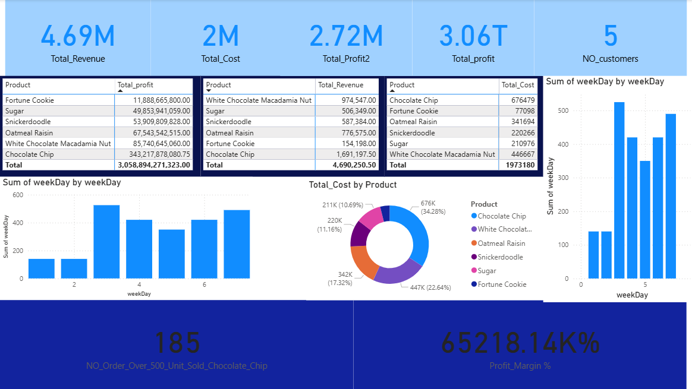

# Cookie Sales Analysis Dashboard – Power BI

## Overview
This project presents an interactive sales analysis dashboard built using Microsoft Power BI. The dashboard analyzes cookie product sales to provide insights into revenue, cost, profit, and customer purchasing behavior.

The report uses calculated measures and data visualization techniques to transform raw sales data into meaningful business insights.

---

## Dashboard Preview

---

## Project Objectives
The goal of this project is to analyze product sales performance and identify patterns in revenue and profitability.

Key objectives include:

- Analyzing total revenue, cost, and profit
- Identifying the most profitable cookie products
- Understanding sales patterns across different days of the week
- Measuring profit margins
- Tracking customer purchasing behavior

---

## Key Metrics
The dashboard includes several important business metrics:

- **Total Revenue**
- **Total Cost**
- **Total Profit**
- **Profit Margin (%)**
- **Number of Customers**
- **Orders exceeding sales thresholds**

---

## Data Analysis
The analysis was performed using calculated measures and functions in Power BI to derive key performance indicators.

Examples of analytical calculations include:

- Revenue aggregation
- Cost calculations
- Profit calculation (Revenue – Cost)
- Profit margin percentage
- Product-level sales analysis
- Weekday sales analysis

---

## Visualizations
The dashboard contains multiple visual components to explore the data:

- KPI Cards for key metrics
- Product performance tables
- Revenue comparison by product
- Cost distribution by product
- Profit analysis
- Sales trends by weekday
- Donut chart showing product cost distribution

These visualizations allow users to quickly identify patterns and business insights.

---

## Tools & Technologies
- Microsoft Power BI
- Data Modeling
- DAX Calculated Measures
- Data Visualization

---

## Files Included
This repository includes the following files:

- `CookieSalesDashboard.pbix` – Power BI report file
- `cookie_sales_dataset.xlsx` – dataset used for analysis
- `dashboard.png` – dashboard preview image

---

## Skills Demonstrated
This project demonstrates the following data analysis skills:

- Data visualization
- Business data analysis
- Power BI dashboard design
- DAX calculations
- Analytical thinking

---

## Project Type
Data Analysis Project using Microsoft Power BI
